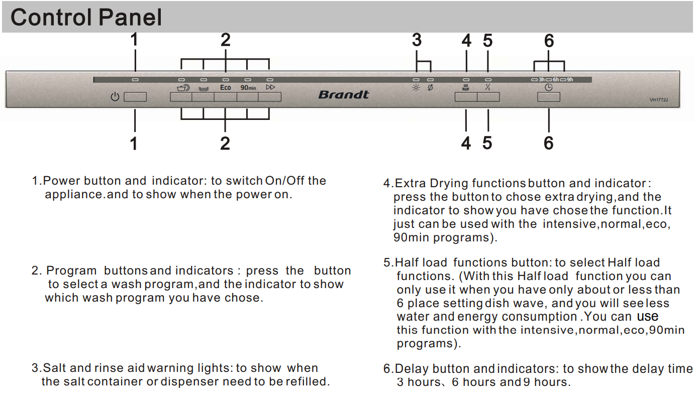
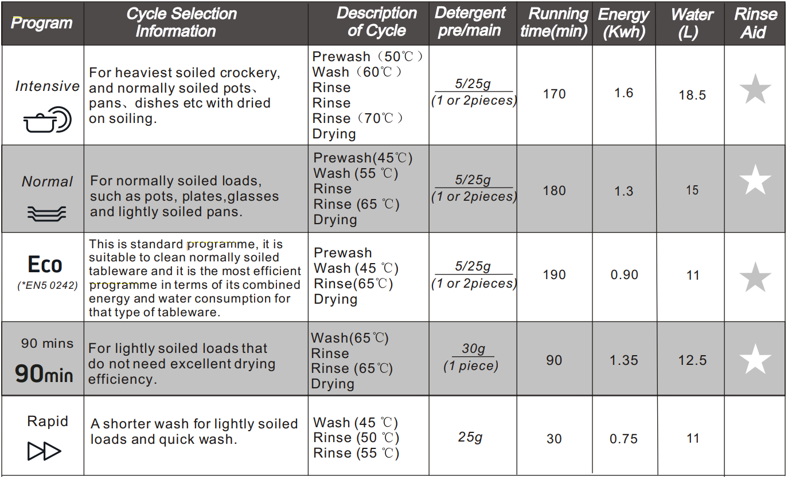

Simple instructions
----

1. Load the dishwasher
1. Put dishwasher detergent tablet in the detergent dispenser. ! DO NOT PUT LIQUID DISH SOAP !!!!
1. Switch the machine ON
1. We recommend the ECO program
1. Close the machine: it should start within 1 minute

Control panel buttons
---

Download detailed manual
---

[Manual](manuals/vh1772j_en.PDF)

