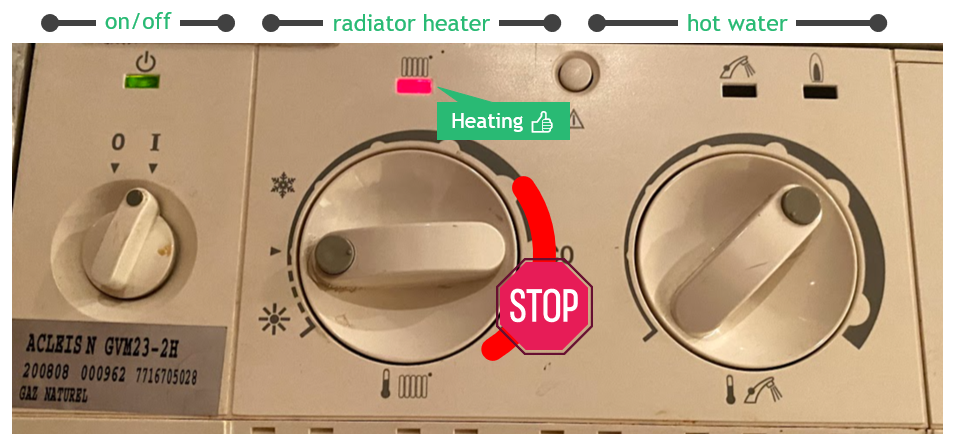
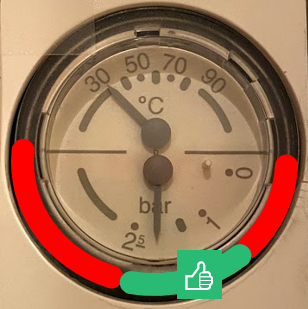
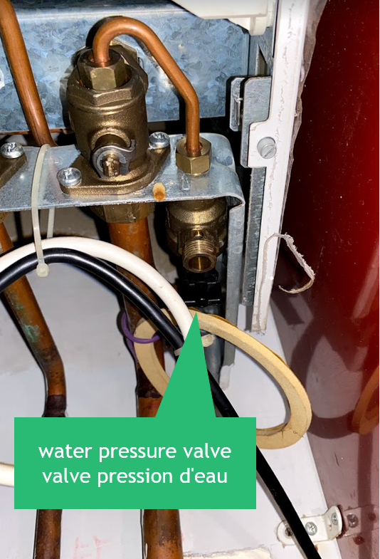

Instructions
===

* Do not go beyond the ECO marker for the radiator heating.
* The pressure indicator must be between 1 and 2 bars (see below). **If below 1bar, please add more water into the radiators** by turning the water pressure valve for a few seconds. Thank you.

Detailed manual
---

[Download detailed manual](manuals/whirlpool_amw487_daily.pdf)
